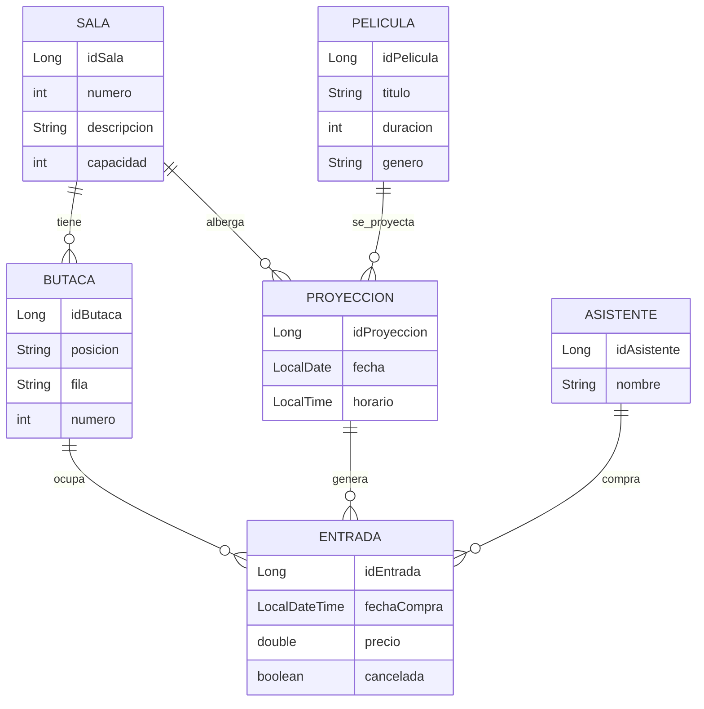

# 🎬 Sistema de Gestión de Cine

## 📌 Descripción del Proyecto

Este proyecto implementa un **sistema de gestión de un cine** desarrollado en **Java con Spring Boot**, que permite administrar salas, butacas, películas, proyecciones, asistentes y la venta de entradas.

El sistema controla la **ocupación de las salas**, evita la **venta duplicada de butacas**, gestiona **cancelaciones con restricciones temporales**, valida **horarios de proyecciones** y aplica reglas de negocio propias de un entorno real de cine.

La aplicación ofrece:

* Una **API REST** para la gestión completa del sistema.
* Un **menú interactivo por consola** para simular el flujo de compra de entradas.

---

## 🧱 Modelo de Datos

### Entidades Principales

* **Sala**: Define una sala del cine con número, descripción y capacidad.
* **Butaca**: Asientos asociados a una sala (entidad dependiente).
* **Película**: Información de las películas proyectadas.
* **Proyección**: Relación entre una película y una sala en una fecha y horario concretos.
* **Asistente**: Usuario que compra entradas.
* **Entrada**: Registro transaccional que vincula asistente, proyección y butaca.

---

## 🗺️ Diagrama Entidad–Relación (ER)



📌 **Restricción clave**:
No se puede vender la misma butaca dos veces para una misma proyección, garantizado mediante:

* Lógica de negocio en el servicio
* Restricción única en base de datos (`idProyeccion + idButaca`)

---

## 🔁 Reglas de Negocio

* Un asistente puede comprar varias entradas.
* Cada entrada corresponde a **una única proyección y una única butaca**.
* Una butaca pertenece a una sola sala.
* No se pueden vender más entradas que la capacidad de la sala.
* No se permite comprar entradas para proyecciones pasadas.
* Una entrada solo puede cancelarse **hasta 2 horas antes** de la proyección.
* Si una entrada se cancela, la butaca vuelve a estar disponible.
* El sistema controla el aforo y la ocupación en tiempo real.

---

## ⚙️ Funcionalidades Principales

* Gestión de asistentes (crear, listar, actualizar, eliminar).
* Gestión de salas y generación automática de butacas.
* Gestión de películas.
* Gestión de proyecciones (por sala, película y fecha).
* Compra de entradas con selección de butaca.
* Cancelación de entradas con validaciones.
* Consulta de asientos libres.
* Consulta de ocupación de una proyección.
* Manejo global de excepciones.

---

## 📡 Endpoints Principales (API REST)

### Asistentes

| Método | Endpoint            | Descripción              |
| ------ | ------------------- | ------------------------ |
| POST   | `/asistentes/crear` | Crear asistente          |
| GET    | `/asistentes`       | Listar asistentes        |
| GET    | `/asistentes/{id}`  | Obtener asistente por ID |
| PUT    | `/asistentes/{id}`  | Actualizar asistente     |
| DELETE | `/asistentes/{id}`  | Eliminar asistente       |

### Salas

| Método | Endpoint      | Descripción         |
| ------ | ------------- | ------------------- |
| POST   | `/salas`      | Crear sala          |
| GET    | `/salas`      | Listar salas        |
| GET    | `/salas/{id}` | Obtener sala por ID |
| DELETE | `/salas/{id}` | Eliminar sala       |

### Películas

| Método | Endpoint          |
| ------ | ----------------- |
| GET    | `/peliculas`      |
| GET    | `/peliculas/{id}` |
| POST   | `/peliculas`      |
| PUT    | `/peliculas/{id}` |
| DELETE | `/peliculas/{id}` |

### Proyecciones

| Método | Endpoint                              |
| ------ | ------------------------------------- |
| POST   | `/proyecciones/crear`                 |
| GET    | `/proyecciones`                       |
| GET    | `/proyecciones/{id}`                  |
| GET    | `/proyecciones/sala/{idSala}`         |
| GET    | `/proyecciones/pelicula/{idPelicula}` |
| GET    | `/proyecciones/fecha/paginado`        |
| GET    | `/proyecciones/ocupacion/{id}`        |

### Entradas

| Método | Endpoint                         | Descripción            |
| ------ | -------------------------------- | ---------------------- |
| POST   | `/entradas/comprar`              | Comprar entrada        |
| PUT    | `/entradas/cancelar/{id}`        | Cancelar entrada       |
| GET    | `/entradas/libres?idProyeccion=` | Asientos libres        |
| GET    | `/entradas/asistente/{id}`       | Entradas por asistente |
| GET    | `/entradas/ocupacion/{id}`       | Ocupación              |

---

## 🖥️ Menú por Consola

La aplicación incluye un menú interactivo que permite:

```
1 - Crear asistente
2 - Listar asistentes
3 - Listar proyecciones
4 - Comprar entrada
5 - Cancelar entrada
6 - Ver entradas de un asistente
7 - Ver ocupación de una proyección
0 - Salir
```

---

## ▶️ Instrucciones de Ejecución

### Requisitos

* Java 17 o superior
* Maven
* IDE compatible (IntelliJ, Eclipse, VS Code)

### Pasos

1. Clonar el repositorio:

```bash
git clone https://github.com/ANNGGEE/cine/
```

2. Ejecutar el proyecto:

```bash
mvn spring-boot:run
```

3. Al iniciar:

* Se cargan **datos de ejemplo automáticamente**
* Se puede usar la **API REST** o el **menú por consola**

---

## 🛠️ Tecnologías Utilizadas

* Java 17
* Spring Boot
* Spring Data JPA
* Hibernate
* Spring Security (configuración básica)
* H2 / Base de datos en memoria
* Maven
* Lombok

---

## ✍️ Autor

**Ángela Gómez López**
Proyecto académico – Sistema de Gestión de Cine
